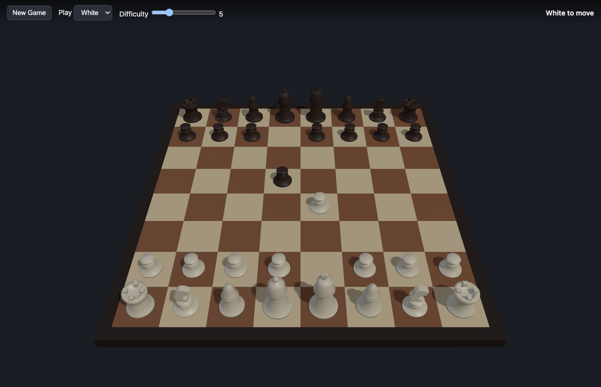

# 3D Chess

A web-based chess game rendered in 3D. Play against a built-in Stockfish AI on a board you can freely orbit with the mouse. Standard chess rules; the "3D" is the presentation.

**▶ Play it live: https://mglass222.github.io/3dchess/**



## Requirements

- Node.js 18+ and npm

## Setup

```bash
npm install
```

`npm install` also runs a `postinstall` step that vendors the Stockfish engine
(`stockfish-18-lite-single.js` + `.wasm`) into `public/engine/`. That directory is
generated and git-ignored; if it's ever missing, run `node scripts/copy-engine.js`.

## Run

```bash
npm run dev      # start the dev server, then open the printed local URL
npm run build    # production build into dist/
npm run preview  # serve the production build
```

The `main` branch auto-deploys to **https://mglass222.github.io/3dchess/** via GitHub Actions (`.github/workflows/deploy.yml`) on every push.

## Test

```bash
npm test         # run the unit suite (Vitest)
```

## Controls

- **Drag** with the mouse to orbit the camera around the board (360°, and tilt down to view from underneath; "up" stays up).
- **Mouse wheel** to zoom.
- **Click** one of your pieces to select it — its legal moves highlight — then **click** a highlighted square to move.
- **New Game** resets; **Play** chooses your color; **Difficulty** sets the AI strength (Stockfish Skill Level 0–20).

## How it works

- **Rendering** — Three.js scene with an orbit-only camera, GLB chess-piece models loaded via `GLTFLoader` (preloaded into normalized, tintable templates), and animated moves (`src/scene.js`, `src/pieces.js`, `src/coords.js`).
- **Rules** — `chess.js` wrapped by `src/game.js`, which is the source of truth and emits board "change-sets" for the view to animate.
- **AI** — Stockfish compiled to WebAssembly, run in a Web Worker (`src/engine.js`) and driven by `src/ai.js` over the UCI protocol.
- **Input / UI** — click-to-move with raycasting (`src/input.js`) and a minimal DOM overlay (`src/ui.js`); `src/main.js` wires it all together.

## Credits

- 3D chess piece models: ["chess-3d"](https://github.com/ernest-rudnicki/chess-3d) by Ernest Rudnicki, MIT License (see `public/models/LICENSE.txt`).
- Chess engine: [Stockfish](https://stockfishchess.org/). Rules: [chess.js](https://github.com/jhlywa/chess.js). Rendering: [three.js](https://threejs.org/).
