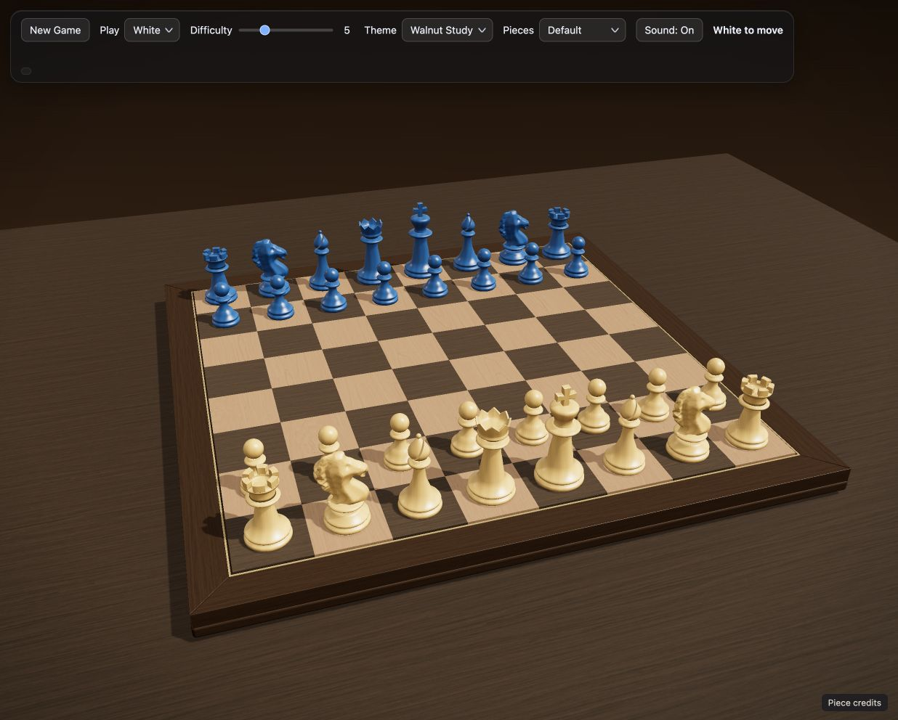

# 3D Chess

Play chess against Stockfish in a 3D scene with detailed pieces, a wooden board, and recorded piece sounds. Rotate the camera, choose a visual theme, and adjust the computer's strength.

**[Play in your browser](https://mglass222.github.io/3dchess/)**



## Features

- **Standard chess rules**, including castling, en passant, and a promotion picker.
- **Stockfish opponent** with adjustable difficulty and a choice of playing White or Black.
- **Two piece sets:** detailed Default Staunton pieces and an alternative Downloaded set.
- **Five visual themes**, including Walnut Study and Cosmos, with coordinated backgrounds and lighting.
- **Textured wood surfaces**, a crafted board frame, and a furnished table setting.
- **Recorded landing sounds** for moves and captures, with a saved mute setting.
- **Move history, captured-piece trays, and material advantage**, plus highlights for legal moves, the last move, and check.

## How to play

Click one of your pieces, then click a highlighted destination to move. When a pawn promotes, choose its new piece from the picker.

| Control | Action |
| --- | --- |
| Drag the board | Orbit the camera through 360° and tilt from above to just above board level. |
| Mouse wheel | Zoom in or out. |
| Play | Choose your color for the next game. |
| New Game | Start over using the selected color and difficulty. |
| Difficulty | Adjust Stockfish's skill level from 0 to 20. |
| Theme | Change the background and lighting. |
| Pieces | Switch piece sets while keeping the current position. |
| Sound: On / Off | Enable or mute piece sounds. |

Theme, piece-set, and sound preferences are remembered between visits. Audio becomes available after you interact with the page.

## Run locally

Use **Node.js 22 or newer** and npm. From the project directory:

```bash
npm ci
npm run dev
```

Open the local URL printed by Vite.

Installation automatically copies the Stockfish JavaScript and WebAssembly files into `public/engine/`. If installation scripts were disabled or those files are missing, restore them with:

```bash
node scripts/copy-engine.js
```

### Development commands

| Command | Purpose |
| --- | --- |
| `npm run dev` | Start the development server. |
| `npm test` | Run the Vitest test suite. |
| `npm run test:watch` | Rerun tests as files change. |
| `npm run build` | Create a production build in `dist/`. |
| `npm run preview` | Serve the production build locally after building. |
| `npm run models:build` | Regenerate the Default piece models. |

The production build uses the `/3dchess/` base path. To host it at another path, update `base` in [vite.config.js](vite.config.js) before building.

The Default GLBs are already included; rebuilding models is only needed when changing their geometry. The authoring script uses the bundled Downloaded set as the knight-head source and runs meshoptimizer offline. See the [model authoring notes](public/models/Default/README.md).

## Project guide

| Area | Files |
| --- | --- |
| App setup, turns, and board synchronization | [`src/main.js`](src/main.js) |
| Chess rules and move handling | [`src/game.js`](src/game.js), [`src/input.js`](src/input.js) |
| Stockfish worker and AI requests | [`src/engine.js`](src/engine.js), [`src/ai.js`](src/ai.js) |
| Scene, furniture, pieces, and animation | [`src/scene.js`](src/scene.js), [`src/furnishing.js`](src/furnishing.js), [`src/pieces.js`](src/pieces.js), [`src/camera.js`](src/camera.js) |
| Themes and controls | [`src/themes.js`](src/themes.js), [`src/ui.js`](src/ui.js) |
| Recorded audio and playback | [`src/sound.js`](src/sound.js), [`public/audio/`](public/audio/) |
| Tests | [`test/`](test/) |

The game runs in the browser. Stockfish uses a Web Worker, Three.js renders the scene, and Web Audio plays the bundled landing sample in sync with piece contact.

## Credits

- **Default pieces:** original Staunton bodies and crowns generated by [the model authoring script](scripts/build-default-pieces.js).
- **Knight head and Downloaded set:** [Realistic Chess Set 3D Model](https://sketchfab.com/3d-models/realistic-chess-set-3d-model-a07b3ac3f57f4fa3822e3f2d6241a7b0) by [noob-3d](https://sketchfab.com/noob-3d), licensed [CC BY 4.0](https://creativecommons.org/licenses/by/4.0/). The Default knight head is adapted; see the [model credits and modification notice](public/models/Default/LICENSE.txt).
- **Board textures:** CC0 cherry and walnut veneer maps from Poly Haven. See the [texture sources and credits](public/textures/board/README.md).
- **Landing sound:** the second impact in [chess pieces.wav](https://freesound.org/people/simone_ds/sounds/366065/) by simone_ds, released under CC0. See the [audio source and editing notes](public/audio/README.md).
- **Libraries:** [Stockfish](https://stockfishchess.org/), [chess.js](https://github.com/jhlywa/chess.js), and [Three.js](https://threejs.org/).
